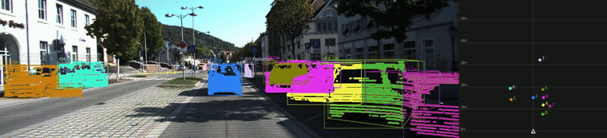

# camera-lidar-axelera-deploy

Camera + LiDAR 3D object detection and tracking, deployable on either a
normal CPU (FP32 PyTorch) or an Axelera Metis AIPU (compiled int8 models on
real hardware). Standalone: bundles its own weights, compiled hardware
artifacts, and a small KITTI demo clip.



*CPU (FP32) backend, sequence 0011: 2D boxes, LiDAR points colored by
frustum membership, projected 3D box wireframes, and a bird's-eye-view
trajectory panel. Generate this yourself with `make demo-cpu`. A real
recording from the Axelera Metis hardware backend is at
[`docs/evidence/demo_hw.mp4`](docs/evidence/demo_hw.mp4).*

## What this does

**Stage A** — a fine-tuned YOLOv8n (`tracker2d`) detects 2D boxes in the
camera image and tracks them frame-to-frame via IoU/Hungarian matching.
**Stage B** — for each track's 2D box, LiDAR points that project inside it
are extracted as a "frustum" (with ground-plane and depth-outlier
filtering). **Stage C** — a from-scratch PointNet-lite (`pointnet_lite`)
regresses a 3D box (center, dimensions, heading) from each frustum's
points. **Stage D** — a lightweight 3D tracker relinks IDs across
occlusion gaps and rejects implausible center jumps.

```
 camera frame ──▶ tracker2d (2D detect + track) ──┐
                                                    ├──▶ frustum extract ──▶ pointnet_lite (3D regress) ──▶ 3D track/relink ──▶ render
 LiDAR sweep  ──────────────────────────────────────┘
```

Both backends run this exact same pipeline shape — `pipeline/` holds the
backend-independent pieces (calibration, frustum extraction, 2D/3D
tracking, rendering); `backends/cpu/` and `backends/hardware/` each
implement just the detection/regression calls.

## Repo layout

```
pipeline/            backend-agnostic: calibration, frustum extraction, 2D/3D tracking, rendering
backends/cpu/         FP32 PyTorch detector + regressor + single-pass pipeline orchestration
backends/hardware/    Axelera-compiled models + 3-pass pipeline orchestration + compile/ (reproducibility)
weights/              trained FP32 weights (tracker2d, pointnet_lite)
data/kitti_demo_clip/ 50-frame KITTI sequence 0011 clip (images, LiDAR, calibration)
scripts/              demo.py (unified, either backend), deploy_to_device.sh
tests/                geometry, CPU pipeline, hardware pipeline (self-skips off-device)
docs/HARDWARE_NOTES.md  the technical story: bugs found, fixes applied, why the code looks the way it does
```

## Requirements

**CPU backend**: Python 3.12, `requirements-cpu.txt` (torch/torchvision/ultralytics
+ numpy/opencv/scipy + pytest). No GPU required (falls back to CPU
automatically), but one speeds things up.

**Hardware backend**: a physical Axelera Metis device running Voyager SDK
1.6.1 firmware, reachable over SSH. `axelera.runtime` isn't installed by
this project — it comes from the Voyager SDK's own on-device Python
environment. Compiling the models from scratch (`backends/hardware/compile/`)
additionally needs the full Voyager SDK installed somewhere with
`axelera.compiler`.

## Quick start

```bash
make setup-cpu       # create .venv, install requirements-cpu.txt
make test-cpu        # geometry + CPU pipeline tests, using the bundled weights/data
make demo-cpu        # renders demo_cpu.mp4 from the bundled 50-frame KITTI clip
```

```bash
make deploy          # copy this project to the Axelera device (see scripts/deploy_to_device.sh
                      # for prerequisites -- typically a local docker container for a jump host)
make test-hardware    # ssh in, run tests/test_hardware_pipeline.py on-device
make demo-hardware    # ssh in, render demo_hardware.mp4 on-device, copy it back
```

`scripts/demo.py` and both `backends/*/pipeline.py` modules expose the same
interface either way — the only thing that changes is which backend
`scripts/demo.py --backend {cpu,hardware}` imports.

## Known limitations

- `pointnet_lite` is compiled for **255** LiDAR points per frustum, not 256
  — a hardware reduction-instruction limit, not a bug. Point-count-invariant
  by design, so this doesn't need retraining. See `docs/HARDWARE_NOTES.md`.
- The hybrid per-channel weight quantization scheme was tried for
  `tracker2d` and found to make **zero difference** for this specific
  model (byte-identical compiled weights to per-tensor histogram) — not
  worth revisiting without a different model architecture.
- `docs/evidence/demo_hw.mp4` is a real recording from an earlier
  successful hardware run, kept as proof-of-life; it's not regenerated
  automatically.

See `docs/HARDWARE_NOTES.md` for the full technical narrative — several
of the fixes in this codebase (the letterbox preprocessing, the pointnet
compiler-bug workaround chain, the 3-pass AIPU scheduling) look like
unusual choices unless you know the bug they were fixing.
